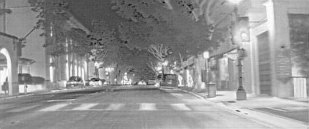
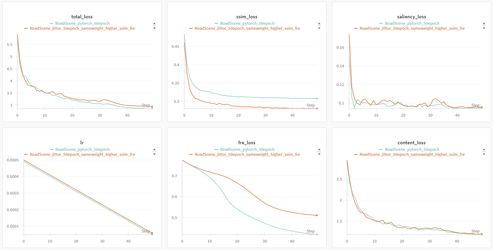

# SFDFusion: Jittor Implementation

## Jittor Migration Note

This project is an implementation of SFDFusion migrated from PyTorch to the Jittor deep learning framework. The migration focuses on leveraging Jittor's unique features, such as the Just-In-Time (JIT) compiler, while ensuring functional equivalence with the original PyTorch version. Key migration efforts include adapting the model architecture, data loading pipeline, and training loop to Jittor's specific API and execution model.

Original project link:

[SFDFusion: An Efficient Spatial-Frequency Domain Fusion Network for Infrared and Visible Image Fusion](https://github.com/lqz2/SFDFusion)

## Comparison

### Result

The following shows the small-scale fusion results using the RoadScene dataset, aiming to verify the consistency before and after migration.

#### PyTorch


#### Jittor



### Process



## Environments

```
python 3.8+
cuda 11.x
jittor
```

## Install

```
conda create -n SFD_Jittor python=3.8
conda activate SFD_Jittor
# Install Jittor first
python -m pip install jittor
# Then install other dependencies
pip install -r requirements.txt
```

## Train

The training process needs wandb API key.
The config file is `./configs/cfg.yaml`

```
python train.py
```

## Inference

```
python fuse.py
```

## Dataset

MSRS dataset is used to train. You can get it from [here](https://github.com/Linfeng-Tang/MSRS).
